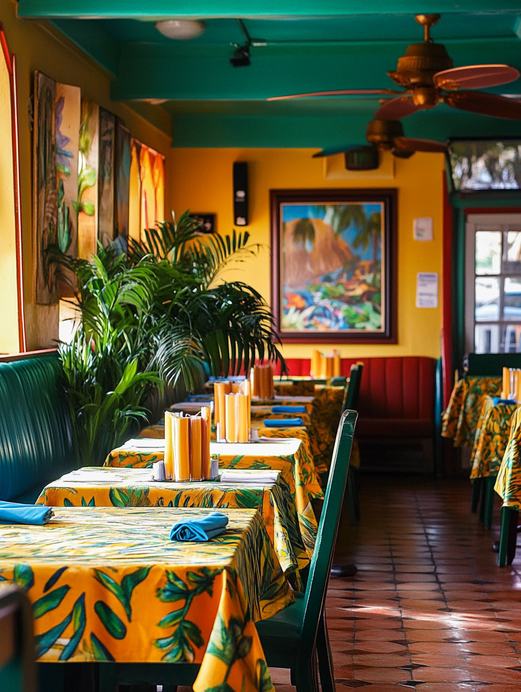

## License

This project is © Gradi Kayamba, 2025. All rights reserved. This code may not be copied, modified, or distributed without explicit permission.

# Island Vibes Kitchen

<div align="center">
  
  <h3>Authentic Jamaican Cuisine</h3>
</div>

## About this Project

Island Vibes Kitchen is a responsive, visually engaging website for a local Jamaican restaurant. The site showcases authentic Caribbean cuisine with a focus on traditional Jamaican dishes and the vibrant culture they represent.



## Features

- **Fully Responsive Design**: Optimized for all devices from mobile phones to large desktop screens
- **Interactive Elements**: Including customizable meal options, interactive menu categories, and hover effects
- **SEO Optimized**: Built with best practices for search engine visibility
- **Cross-Browser Compatible**: Tested and working properly on all modern browsers
- **Performance Focused**: Fast loading times with optimized images and efficient code

## Technology Stack

- HTML5
- CSS3 (with custom animations)
- Vanilla JavaScript (no frameworks)
- Mobile-first responsive design
- Semantic HTML for accessibility and SEO

## Pages

The website consists of the following pages:

- **Home**: Introduction to Island Vibes Kitchen with featured dishes and ambiance
- **Menu**: Comprehensive menu organized by categories (starters, main dishes, sides, etc.)
- **About Us**: The story of the restaurant, its founders, and their culinary philosophy
- **Events & Catering**: Information about private events and catering services
- **Meal Customization**: Interactive page for customizing the signature Jamaican Burrito Bowl
- **Contact**: Business hours, location, and a contact form

## Design Elements

- Color palette inspired by the Jamaican flag and Caribbean aesthetics
- Typography using Montserrat for headings and Open Sans for body text
- Custom animations for a dynamic user experience
- Authentic food photography highlighting Jamaican cuisine

## SEO Implementation

- Comprehensive meta descriptions and titles optimized for each page
- Structured data using Schema.org for enhanced search results
- Mobile-friendly design (Google's Mobile-First Indexing)
- Optimized image alt tags
- Semantic HTML structure
- Sitemap.xml and robots.txt integration

## Preview

Here are some highlights from the website:

### Home Page
A vibrant introduction to the restaurant with a focus on authentic Jamaican flavors.

### Menu Page
Showcasing the diverse selection of traditional dishes with appealing visuals and descriptions.

### Customizable Meals
Interactive elements allowing customers to personalize their dining experience.

## Setup and Installation

1. Clone or download the project files
2. Open the project in your preferred code editor
3. To serve the site locally:
   - Using Python's built-in server:
     ```bash
     python -m http.server 5000
     ```
   - Or use any local development server of your choice

The site will be available at `http://0.0.0.0:5000`

No build process or dependencies required - this is a pure HTML, CSS, and JavaScript project.

## Development Notes

- The site uses a mobile-first approach with media queries for larger screens
- CSS variables are used for consistent colors and styling
- JavaScript is modular and follows best practices for performance

## Future Enhancements

Potential future improvements could include:

- Online ordering system integration
- Customer review and rating functionality
- Image gallery of restaurant events
- Additional animations and interactive elements
- Blog section featuring Jamaican cuisine and culture

## License

This project is available for educational purposes. Please contact the repository owner for commercial usage.

## Credits

- Website design and development: Gradi Kayamba
- Food photography: Gradi Kayamba
